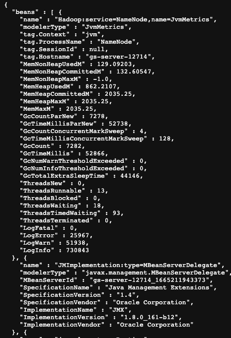

json exporter 可以采集绝大多数大数据组件的监控数据。
事实上，他可以采集任何组件的监控数据，只要这个组件的监控数据是以 http json 的方式暴露出来的。
比如 hadoop namenode的监控数据 可以通过 activeNameNodeIp:50070/jmx 访问到,数据如下图：



如何使用:
基础配置：配置需要采集的组件的监控数据http端口，进程名，和组件名(用作给监控数据打标签).它就可以自动在所部署的机器上发现该进程，并且从你配置的端口采集监控数据。
你可以配置多个需要采集的组件。
以下是一个配置示例 采集 了  HiveServer2  HbaseMaster  HbaseRegionServer  YarnResourceManager YarnNodeManager HadoopNameNode
 HadoopDataNode  ImpalaImpalad ImpalaCatalogd 这些组件的jmx数据。
```
listenAddr: 0.0.0.0:9308
Components:
  - { name: "HiveServer2",port: 10002,processName: "Dproc_hiveserver2" }
  - { name: "HbaseMaster",port: 16010,processName: "org.apache.hadoop.hbase.master.HMaster"}
  - { name: "HbaseRegionServer",port: 16030,processName: "org.apache.hadoop.hbase.regionserver.HRegionServer"}
  - { name: "YarnResourceManager",port: 8088,processName: "org.apache.hadoop.yarn.server.resourcemanager.ResourceManager"}
  - { name: "YarnNodeManager",port: 8042,processName: "Dproc_nodemanager"}
  - { name: "HadoopNameNode",port: 50070,processName: "org.apache.hadoop.hdfs.server.namenode.NameNode"}
  - { name: "HadoopDataNode",port: 1022,processName: "Dproc_datanode"}
  - { name: "ImpalaImpalad",port: 25000,processName: "impalad"}
  - { name: "ImpalaCatalogd",port: 25020,processName: "catalogd"}
```


白名单：注意，由于很多组件暴露的监控数据项非常多，如果全部采集，会对存储端造成很大的压力。因此，使用白名单配置，可以只采集需要的监控数据，大大降低时序数据库的压力。
如果需要采集所有的指标，也可以在配置项中手动关闭白名单。
如何配置白名单：
1.配置白名单目录
可以为所有的组件配置一个全局白名单目录，使用 whiteListDir 配置项
```
listenAddr: 0.0.0.0:9308
whiteListDir: "/usr/local/expoter/conf/"
Components:
- { name: "HiveServer2",port: 10002,processName: "Dproc_hiveserver2" }
- { name: "HbaseMaster",port: 16010,processName: "org.apache.hadoop.hbase.master.HMaster"}
```

也可以单独为每个组件配置白名单目录，这个目录会覆盖全局的白名单目录,如果不配置就会使用全局的白名单目录。
```
listenAddr: 0.0.0.0:9308
whiteListDir: "/usr/local/expoter/conf/"
Components:
- { name: "HiveServer2",port: 10002,processName: "Dproc_hiveserver2", whiteListDir: "/usr/local/expoter/HiveServer2/" }
- { name: "HbaseMaster",port: 16010,processName: "org.apache.hadoop.hbase.master.HMaster"}
```
2.创建白名单文件
白名单文件的名称是配置文件中 组件{name}.json， 比如上述 hive 组件的配置中的 name 属性是 HiveServer2 ，那么白名单的文件名就是 HiveServer2.json 
白名单文件示例
比如请求hive server的监控数据如下
http://xx.xxx.xx.xx:10002/jmx

```
{
  "beans" : [ {
    "name" : "org.apache.logging.log4j2:type=6aaa5eb0,component=Appenders,name=console",
    "modelerType" : "org.apache.logging.log4j.core.jmx.AppenderAdmin",
    "Name" : "console",
    "ErrorHandler" : "org.apache.logging.log4j.core.appender.DefaultErrorHandler@3bed98b4",
    "Filter" : "null",
    "Layout" : "%d{ISO8601} %5p [%t] %c{2}: %m%n",
    "IgnoreExceptions" : true
  }, {
    "name" : "java.lang:type=OperatingSystem",
    "modelerType" : "sun.management.OperatingSystemImpl",
    "OpenFileDescriptorCount" : 670,
    ...
  },{
    "name" : "java.lang:type=MemoryPool,name=Code Cache",
    "modelerType" : "sun.management.MemoryPoolImpl",
    "Usage" : {
      "committed" : 52690944,
      "init" : 2555904,
      "max" : 251658240,
      "used" : 52043648
    },
    "PeakUsage" : {
      "committed" : 52690944,
      "init" : 2555904,
      "max" : 251658240,
      "used" : 52046400
    }
```
如果你想要采集 OpenFileDescriptorCount
那么白名单文件 HiveServer2.json 如下
```
{
"OpenFileDescriptorCount": "Description of this metric"
}
```
注意如果要采集  "committed" : 52690944 这个指标的值,需要打开递归采集
```
- { name: "HiveServer2",port: 10002,processName: "Dproc_hiveserver2",allowRecursiveParse: "true"}
```

然后白名单中的指标名称需要用下划线连接其所有父map的key
```
{
"Usage_committed": "Description of this metric"
}
```
关于递归采集：个别组件的一些监控指标所在的json 层级比较深，因此需要递归采集。这个选项默认是关闭的，需要在配置文件中手动开启。
开启的配置项为 allowRecursiveParse 
```
- { name: "HiveServer2",port: 10002,processName: "Dproc_hiveserver2",allowRecursiveParse: "true"}
```

采集地址配置：
采集地址默认会采集 {componentIp}:port/jmx 的监控数据。
HiveServer2  HbaseMaster  HbaseRegionServer  YarnResourceManager YarnNodeManager HadoopNameNode
HadoopDataNode  ImpalaImpalad ImpalaCatalogd 对于这些组件，他们的jmx 监控数据的地址都是 {componentIp}:port/jmx， 
因此不需要额外配置采集地址。
如果你需要采集的组件的监控数据的url 不是 {componentIp}:port/jmx，那需要配置 jmxUrlSuffix 配置项。
例如你的监控数据地址是  {componentIp}:port/metrics 那么配置如下
```
- { name: "HiveServer2",port: 10002,processName: "Dproc_hiveserver2",allowRecursiveParse: "true",jmxUrlSuffix: "/metrics"}
```
全局配置项
listenAddr      exporter 监听地址
whiteListDir    白名单目录
Components （类型数组） 需要采集的组件

组件配置项
processName      组件进程名（默认为空）
port             组件端口（默认为空）
name             组件名（默认为空）
whiteListDir     组件白名单目录 （默认为空）
allowRecursiveParse     是否允许递归采集（默认关闭）
allowMetricsWhiteList   是否开启白名单（默认开启）
jmxUrlSuffix           组件的jmx url 地址（默认 /jmx）


